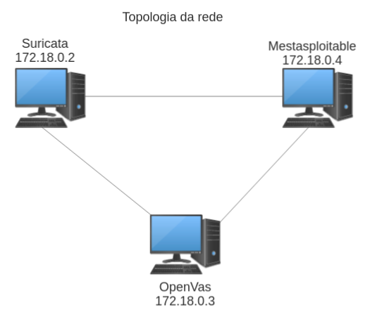

## Introdução

### Topologia da rede

A topologia da rede é:



***

### Container com OpenVas

Para utilizar o `OpenVas` dentro de um container `Docker` iremos utilizar a imagem `mikesplain/openvas` que já possui o `OpenVas` instalado e configurado. Entretanto, precisamos atualizar o banco de dados de vulnerabilidades do `OpenVas`, para isso iremos setar algumas variáveis de ambiente e sincronizar o banco de dados.

`Dockerfile` do container com OpenVas:

```Dockerfile
FROM mikesplain/openvas:latest

ENV FEED=feed.community.greenbone.net
ENV COMMUNITY_NVT_RSYNC_FEED=rsync://$FEED:/nvt-feed
ENV COMMUNITY_CERT_RSYNC_FEED=rsync://$FEED:/cert-data
ENV COMMUNITY_SCAP_RSYNC_FEED=rsync://$FEED:/scap-data
RUN greenbone-nvt-sync
RUN greenbone-certdata-sync
RUN greenbone-scapdata-sync
RUN service openvas-scanner restart
RUN service openvas-manager restart
RUN service openvas-gsa restart
```

Essa atualização é particularmente demorada, então é interessante que seja feita apenas uma vez, e que o container seja salvo como uma nova imagem.

depois que o container estiver rodando, devemos acessar o container e rodar:

```bash
openvasmd --rebuild --progress
```

Isso irá atualizar o banco de dados do `OpenVas` e é necessário para que o `OpenVas` funcione corretamente.

***

### Container com Suricata

Para utilizar o Suricata dentro de um container `Docker` iremos utilizar a imagem `ubuntu:latest` e instalar o Suricata a partir do repositório oficial. Também iremos instalar algumas ferramentas auxiliares de rede, como `tcpdump` e `iptables`.

`Dockerfile` do container com Suricata:

```Dockerfile
FROM ubuntu:20.04

# Instalando dependencias
RUN apt update && apt install -y \
    software-properties-common

# Instalando Suricata
RUN add-apt-repository -y ppa:oisf/suricata-stable

RUN apt install -y suricata

# Instalando ferramentas auxiliares de rede
RUN apt install -y \
    dnsutils \
    iputils-ping \
    net-tools \
    tcpdump \
    iproute2 \
    iptables

# Utilizando uma configuração local, para facilitar a utilização
COPY ./suricata/ /etc/suricata/

# Copiando regra do scp
COPY ./suricata/rules/scp.rules /var/lib/suricata/rules/scp.rules

# Instalando pre-requisitos do openssh vulnerável
RUN apt install -y \
    libssl-dev \
    zlib1g-dev \
    build-essential \
    gcc

# Instalando openssh vulnerável
COPY ./install_vuln.sh /install_vuln.sh
RUN chmod +x /install_vuln.sh
RUN /install_vuln.sh
EXPOSE 22


# criando um usuario de exemplo
RUN useradd -m -d /home/gregio -s /bin/bash gregio
RUN echo 'gregio:gregio' | chpasswd

COPY exploit.sh /exploit.sh

RUN chmod +x /exploit.sh
```

O Dockerfile acima irá configurar o ambiente do Suricata e instalar o `OpenSSH` vulnerável.

## Testando o Suricata

enquanto observamos o log do Suricata:

```bash
tail -f /var/log/suricata/fast.log
```

Podemos testar as regras padrão do `Suricata` utilizando o comando:

```bash
curl http://testmynids.org/uid/index.html
```

Será possível ver o seguinte alerta:

```bash
06/24/2023-17:03:41.271088  [**] [1:2100498:7] GPL ATTACK_RESPONSE id check returned root [**] [Classification: Potentially Bad Traffic] [Priority: 2] {TCP} 65.8.214.24:80 -> 172.18.0.2:42414
```

***

## Ataque escolhido

Por questão de viabilidade, iremos utilizar o `OpenSSH` como serviço vulnerável. A vulnerabilidade escolhida foi a `CVE-2020-15778` que explora uma falha no comando `scp` do `OpenSSH`. A vulnerabilidade permite a execução de comandos arbitrários no servidor.

Para garantir que o serviço estará vulnerável, iremos utilizar a versão `8.3p1` do `OpenSSH` que possui a vulnerabilidade.

A `CVE-2020-15778` explora a **falta de sanitização** no comando `scp` do `OpenSSH`, em específico no caracter **backtick**. A manipulação do argumento de destino do comando `scp` permitindo a execução de comandos com **privilégios incorretos** na máquina de destino.

Os mantenedores do `OpenSSH` reportaram que a **falta de sanitização era intencional**, visto que caso fosse feita a sanitização, a correção poderia **quebrar muitos scripts** que utilizam o comando `scp`.

***

### Configurando a vulnerabilidade

Vamos utilizar o um **script** no container com `Suricata` para instalar o `OpenSSH` vulnerável e configurar o serviço.

```bash
# criando usuario sshd e pasta para privsep
mkdir /var/lib/sshd
chmod -R 700 /var/lib/sshd/
chown -R root:sys /var/lib/sshd/
useradd -r -U -d /var/lib/sshd/ -c "sshd privsep" -s /bin/false sshd

# baixando o openssh
wget https://openbsd.c3sl.ufpr.br/pub/OpenBSD/OpenSSH/portable/openssh-8.3p1.tar.gz

# descompactando e instalando
tar -xvf openssh-8.3p1.tar.gz
cd openssh-8.3p1
./configure --with-md5-passwords --with-privsep-path=/var/lib/sshd/ --sysconfdir=/etc/ssh 

make
make install
```

Dessa forma, o `OpenSSH` com a vulnerabiulidade, estará instalado e configurado para ser utilizado.

***

## Configurando Scan no OpenVas

Por algum motivo o `OpenVas`, em algumas versões e distribuições, desabilita o uso de scanners como o `Nmap` por padrão. Isso nos custou muito tempo de trabalho até descobrirmos que o `OpenVas` estava desabilitando o uso dos scanners de rede.

Para habilitar o uso do `Nmap` no `OpenVas`, precisamos criar um scan customizado e habilitar o uso do `Nmap`. Para isso, precisamos acessar o `OpenVas` e ir em `Configuration` > `Scan Configs` > `New Scan Config` e criar um novo scan com o nome `Full and fast with Nmap`.

De toda forma, mesmo criando um scan customizado, o `OpenVas` não consegue usar o `Nmap` para realizar o scan. Algumas horas foram gastas tentando resolver esse problema, desde reinstalar o `OpenVas` em outra distro, até tentar compilar o `Nmap` dentro do container do `OpenVas`.

Referências para tentar resolver o problema:

- <https://openvas-discuss.openvas.narkive.com/dSeOP4P3/openvas-not-invoking-nmap-how-to-fix>
- <https://github.com/yu210148/gvm_install/issues/26>
- <https://forum.greenbone.net/t/unable-to-get-required-output-while-scanning/9692>
- <https://forum.greenbone.net/t/gsm-trial-not-finding-known-vulnerabilities-metasploitable/9654>

Devido à esse problema, optamos por não gastar mais tempo tentando executar os scans do `OpenVas`. Entretanto configuramos o `Alvo`, o `Scan customizado` e a `Tarefa` para que o `OpenVas` possa ser utilizado.

***

## Como executar

### Iniciando os containers

Para iniciar os containers, precisamos executar o `docker compose`:

```bash
docker compose up -d
```

Após alguns minutos os dois containers estarão rodando e o `OpenVas` estará atualizado. Para abrir o dashboard do `OpenVas` basta acessar `https://localhost:443` e fazer login com o usuário `admin` e senha `admin`.

***

### Iniciando o Suricata e o  OpenSSH vulnerável

Para iniciar o `OpenSSH` vulnerável, precisamos entrar no container `ids` e executar o comando:

```bash
/usr/local/sbin/sshd -D &
```

Assim, o serviço `OpenSSH` estará rodando e pronto para ser explorado.

### Regra no Suricata para detectar o ataque

Para permitir que o suricata detecte o ataque, vamos configurar uma nova regra em `/var/lib/suricata/rules/scp.rules`:

```bash
alert tcp any any -> any any (msg:"PROVAVEL COMANDO SCP MALICIOSO"; content:"SSH"; nocase; content:"`"; sid:9000002; rev:1;)
```

Ela já foi carregada no `Suricata` na inicialização do container.

Essa regra irá detectar o caracter **backtick** no comando `scp` e irá gerar um alerta.

Além disso, precisamos atualizar o arquivo `/etc/suricata/suricata.yaml` para que o Suricata utilize a nova regra:

```yaml
rule-files:
  - scp.rules
```

Este também já foi configurado no container.

Agora, basta atualizar as regras do `Suricata`:

```bash
suricata-update
```

Veremos algo como:
  
```bash
26/6/2023 -- 13:32:17 - <Info> -- Using data-directory /var/lib/suricata.
26/6/2023 -- 13:32:17 - <Info> -- Using Suricata configuration /etc/suricata/suricata.yaml
26/6/2023 -- 13:32:17 - <Info> -- Using /etc/suricata/rules for Suricata provided rules.
26/6/2023 -- 13:32:17 - <Info> -- Found Suricata version 6.0.13 at /usr/bin/suricata.
26/6/2023 -- 13:32:17 - <Info> -- Loading /etc/suricata/suricata.yaml
26/6/2023 -- 13:32:17 - <Info> -- Disabling rules for protocol http2
26/6/2023 -- 13:32:17 - <Info> -- Disabling rules for protocol modbus
26/6/2023 -- 13:32:17 - <Info> -- Disabling rules for protocol dnp3
26/6/2023 -- 13:32:17 - <Info> -- Disabling rules for protocol enip
26/6/2023 -- 13:32:17 - <Info> -- No sources configured, will use Emerging Threats Open
26/6/2023 -- 13:32:17 - <Info> -- Last download less than 15 minutes ago. Not downloading https://rules.emergingthreats.net/open/suricata-6.0.13/emerging.rules.tar.gz.
26/6/2023 -- 13:32:17 - <Info> -- Loading distribution rule file /etc/suricata/rules/app-layer-events.rules
26/6/2023 -- 13:32:17 - <Info> -- Loading distribution rule file /etc/suricata/rules/decoder-events.rules
26/6/2023 -- 13:32:17 - <Info> -- Loading distribution rule file /etc/suricata/rules/dhcp-events.rules
26/6/2023 -- 13:32:17 - <Info> -- Loading distribution rule file /etc/suricata/rules/dnp3-events.rules
26/6/2023 -- 13:32:17 - <Info> -- Loading distribution rule file /etc/suricata/rules/dns-events.rules
26/6/2023 -- 13:32:17 - <Info> -- Loading distribution rule file /etc/suricata/rules/files.rules
26/6/2023 -- 13:32:17 - <Info> -- Loading distribution rule file /etc/suricata/rules/http-events.rules
26/6/2023 -- 13:32:17 - <Info> -- Loading distribution rule file /etc/suricata/rules/ipsec-events.rules
26/6/2023 -- 13:32:17 - <Info> -- Loading distribution rule file /etc/suricata/rules/kerberos-events.rules
26/6/2023 -- 13:32:17 - <Info> -- Loading distribution rule file /etc/suricata/rules/modbus-events.rules
26/6/2023 -- 13:32:17 - <Info> -- Loading distribution rule file /etc/suricata/rules/nfs-events.rules
26/6/2023 -- 13:32:17 - <Info> -- Loading distribution rule file /etc/suricata/rules/ntp-events.rules
26/6/2023 -- 13:32:17 - <Info> -- Loading distribution rule file /etc/suricata/rules/smb-events.rules
26/6/2023 -- 13:32:17 - <Info> -- Loading distribution rule file /etc/suricata/rules/smtp-events.rules
26/6/2023 -- 13:32:17 - <Info> -- Loading distribution rule file /etc/suricata/rules/stream-events.rules
26/6/2023 -- 13:32:17 - <Info> -- Loading distribution rule file /etc/suricata/rules/tls-events.rules
26/6/2023 -- 13:32:17 - <Info> -- Ignoring file rules/emerging-deleted.rules
26/6/2023 -- 13:32:18 - <Info> -- Loaded 43347 rules.
26/6/2023 -- 13:32:18 - <Info> -- Disabled 14 rules.
26/6/2023 -- 13:32:18 - <Info> -- Enabled 0 rules.
26/6/2023 -- 13:32:18 - <Info> -- Modified 0 rules.
26/6/2023 -- 13:32:18 - <Info> -- Dropped 0 rules.
26/6/2023 -- 13:32:18 - <Info> -- Enabled 131 rules for flowbit dependencies.
26/6/2023 -- 13:32:18 - <Info> -- Backing up current rules.
26/6/2023 -- 13:32:20 - <Info> -- Writing rules to /var/lib/suricata/rules/suricata.rules: total: 43347; enabled: 34519; added: 0; removed 0; modified: 0
26/6/2023 -- 13:32:20 - <Info> -- Writing /var/lib/suricata/rules/classification.config
26/6/2023 -- 13:32:20 - <Info> -- No changes detected, exiting.
```

Após isso, as regras do `Suricata` foram atualizadas com base em fontes da verdade confiáveis.

Agora, basta testarmos as regras atualizadas com o comando `suricata -T -c /etc/suricata/suricata.yaml -v`. O resultado deve ser parecido com o seguinte:

```bash
26/6/2023 -- 13:33:34 - <Info> - Running suricata under test mode
26/6/2023 -- 13:33:34 - <Notice> - This is Suricata version 6.0.13 RELEASE running in SYSTEM mode
26/6/2023 -- 13:33:34 - <Info> - CPUs/cores online: 16
26/6/2023 -- 13:33:34 - <Info> - Setting engine mode to IDS mode by default
26/6/2023 -- 13:33:34 - <Info> - fast output device (regular) initialized: fast.log
26/6/2023 -- 13:33:34 - <Info> - eve-log output device (regular) initialized: eve.json
26/6/2023 -- 13:33:34 - <Info> - stats output device (regular) initialized: stats.log
26/6/2023 -- 13:33:38 - <Info> - 2 rule files processed. 34520 rules successfully loaded, 0 rules failed
26/6/2023 -- 13:33:38 - <Info> - Threshold config parsed: 0 rule(s) found
26/6/2023 -- 13:33:38 - <Info> - 34523 signatures processed. 1280 are IP-only rules, 5230 are inspecting packet payload, 27806 inspect application layer, 108 are decoder event only
26/6/2023 -- 13:33:43 - <Notice> - Configuration provided was successfully loaded. Exiting.
26/6/2023 -- 13:33:43 - <Info> - cleaning up signature grouping structure... complete
```

Assim, o Suricata irá detectar qualquer comando `scp` que contenha o char `backtick`.

### Testando a nova regra

Podemos testar a nova regra utilizando o comando `scp`, enquanto observamos o log do Suricata:

```bash
tail -f /var/log/suricata/fast.log
```

rodando, a partir de outra máquina, o comando:

```bash
touch teste
scp teste gregio@172.18.0.2:'`touch /home/gregio/hacked`/home/gregio/teste'
```

Veremos o alerta no log:

```bash
06/26/2023-13:57:20.978293  [**] [1:9000002:1] PROVAVEL COMANDO SCP MALICIOSO [**] [Classification: (null)] [Priority: 3] {TCP} 172.18.0.2:22 -> 172.18.0.3:38676
```

e o arquivo no caminho `/home/gregio/hacked` será criado no container do `Suricata`.

***

### Capturando os pacotes do ataque

Para capturarmos os pacotes do comando `scp` malicioso e salvá-los em um arquivo `pcap`, vamos utilizar o `tcpdump`:
  
```bash
tcpdump -i eth0 -s 0 -w capture.pcap 'tcp port 22 and (tcp[tcpflags] & tcp-push != 0)'
$ tcpdump: listening on eth0, link-type EN10MB (Ethernet), capture size 262144 bytes
```

após rodar o comando `scp` malicioso, veremos:

```bash
29 packets captured
29 packets received by filter
0 packets dropped by kernel
```

Vamos salvar o arquivo `pcap` em um volume e analisá-lo com o `Wireshark`

### Analisando os pacotes capturados

Infelizmente não conseguimos extrair o comando `scp` malicioso do arquivo `pcap` gerado, pois o `tcpdump` não captura o payload dos pacotes.

As informações mais cruciais que conseguimos extrair são os IPs envolvidos no ataque:

- 172.18.0.3:48152 (Cliente)
- 172.18.0.2:22 (Suricata)
e que a versão do `OpenSSH` utilizada foi `SSH-2.0-OpenSSH_8.3`

***

## Replicando o ataque do Pcap

### Preparação

Para replicar o ataque do `Pcap` disponibilizado na prova, vamos utilizar o `tcpreplay`, porém, precisamos ajustar o `MTU` (Maximum Transmission Unit) do arquivo pcap para evitar problemas de fragmentação como `Unable to send packet: Error with PF_PACKET send() [2148]: Message too long (errno = 90)`. Para isso, vamos utilizar o `tcprewrite`:

```bash
tcprewrite --mtu=8000 --mtu-trunc --skip-soft-errors -i malware.pcap -o malware.pcap
```

substituindo assim o pcap original pelo novo pcap com o `MTU` ajustado.

Precisamos também, editar o endereço local contido no `pcap` para um endereço local da nossa rede. Vamos, novamente, utilizar o tcprewrite:

```bash
tcprewrite --srcipmap=192.168.122.150:172.18.0.5 --dstipmap=192.168.122.150:172.18.0.5 -i /tmp/malware.pcap -o /tmp/malware.pcap
```

Isso vai evitar que o `Suricata` tenha problemas na detecção do ataque.

### Regra de detecção do ataque

No `pcap` utilizado a vitima acessa o site `www.mkgastro.com.pl` e faz um `GET Request` no arquivo `/framework/Atube.zip` que contém um malware. Para detectarmos esse ataque, vamos utilizar as seguintes regras:

```bash
alert http any any -> any any (msg:"ALERTA - ACESSO NO SITE www.mkgastro.com.pl"; http.host; content:"www.mkgastro.com.pl"; sid:1000001; rev:1;)

alert tcp any any -> any any (msg:"ALERTA - ACESSO AO ARQUIVO www.mkgastro.com.pl/framework/Atube.zip"; content:"GET"; uricontent:"/framework/Atube.zip"; sid:1000002; rev:1;)
```

A primeira, busca detectar o acesso ao site. Já a segunda, detecta o `GET request` no arquivo malicioso.

Não, podemos esquecer de atualizar as regras do suricata como fizemos antes:

```bash
suricata -T -c /etc/suricata/suricata.yaml -v
```

***

### Simulando o ataque

Enquanto observamos os logs com `tail -f /var/log/suricata/fast.log` vamos utilizar o `tcpreplay` para replicar o ataque:

```bash
tcpreplay -i eth0 -l 0 malware.pcap
```

Poderemos observar os alertas no log do Suricata:

```bash
06/26/2023-23:38:29.223378  [**] [1:2008512:19] ET HUNTING Suspicious User-Agent (C slash) [**] [Classification: A Network Trojan was detected] [Priority: 1] {TCP} 172.18.0.5:65191 -> 185.135.88.187:80
06/26/2023-23:38:29.223378  [**] [1:1000001:1] ALERTA - ACESSO NO SITE www.mkgastro.com.pl [**] [Classification: (null)] [Priority: 3] {TCP} 172.18.0.5:65191 -> 185.135.88.187:80
06/26/2023-23:38:29.223378  [**] [1:1000002:1] ALERTA - ACESSO AO ARQUIVO www.mkgastro.com.pl/framework/Atube.zip [**] [Classification: (null)] [Priority: 3] {TCP} 172.18.0.5:65191 -> 185.135.88.187:80
06/26/2023-23:38:29.223378  [**] [1:2210026:2] SURICATA STREAM ESTABLISHED SYN resend [**] [Classification: Generic Protocol Command Decode] [Priority: 3] {TCP} 172.18.0.5:65191 -> 185.135.88.187:80
06/26/2023-23:38:30.501199  [**] [1:2210023:2] SURICATA STREAM ESTABLISHED SYNACK resend with different ACK [**] [Classification: Generic Protocol Command Decode] [Priority: 3] {TCP} 185.135.88.187:80 -> 172.18.0.5:65191
```

Todos os alertas acima são especificos do tráfego do `pcap`. Podemos ver os alertas que criamos acima e também alguns alertas do `Suricata` logou sobre o tráfego.
